# ML4K AppInventor Extension
Use machine learning in AppInventor, with easy training using text, images, or numbers through the [Machine Learning for Kids](https://machinelearningforkids.co.uk/) website.

[](https://github.com/kylecorry31/ML4K-AI-Extension/releases/download/v1.0.3/ML4K.aix)

## Example

### Text classification


### Image classification
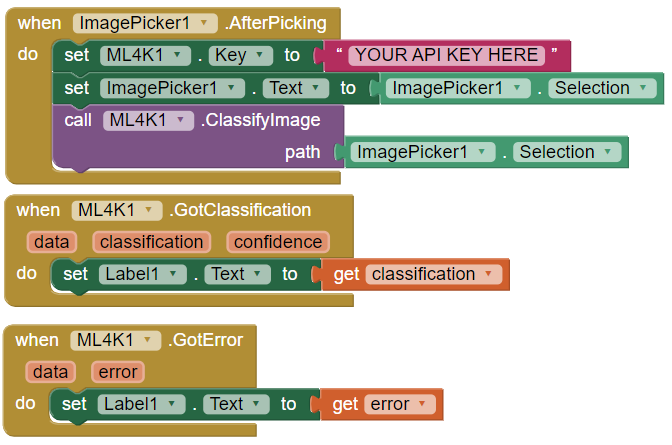

Note: The ClassifyImage block takes the path to an image, which you can get from the Selected property of an ImagePicker.

### Numbers classification
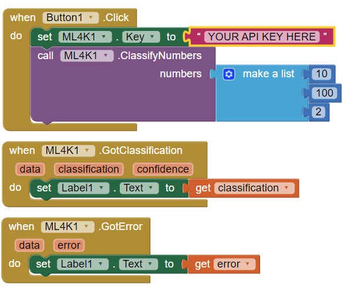

### Live examples
See example .aia projects in the examples directory of this repo (Created by [Joe Mazzone](https://github.com/MrMazzone)). Look at the code blocks for where to add your API key (API key is not included), they are set in the click method - though you can set it anywhere you choose as long as it is before the classification occurs.

## Installation
Download the latest extension file (.aix) from the [releases](https://github.com/kylecorry31/ML4K-AI-Extension/releases) page and follow section "2. How to use extensions components" of [this website](http://ai2.appinventor.mit.edu/reference/other/extensions.html) to add the extension to your App Inventor project.

## Guide  

---  
**If you received this extension from the ML4K website, your API key will be set for you and you don't need the block to set it - skip to step 1 and 2.**  
  
---    

1. After installing the extension, you need to get an API key, which can be obtained from [Machine Learning for Kids](https://machinelearningforkids.co.uk/). This API Key is not the IBM Watson API keys used to create your Machine Learning for Kids account. This API key is specific to your project. It can be found on the App Inventor project page in the unique URL for your project.
  
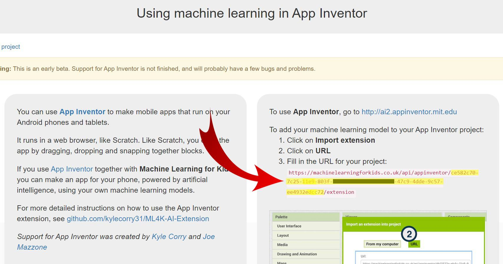  
  
&nbsp;&nbsp;&nbsp;&nbsp;&nbsp;&nbsp; Or, the key can be found on the Python project page.  
  
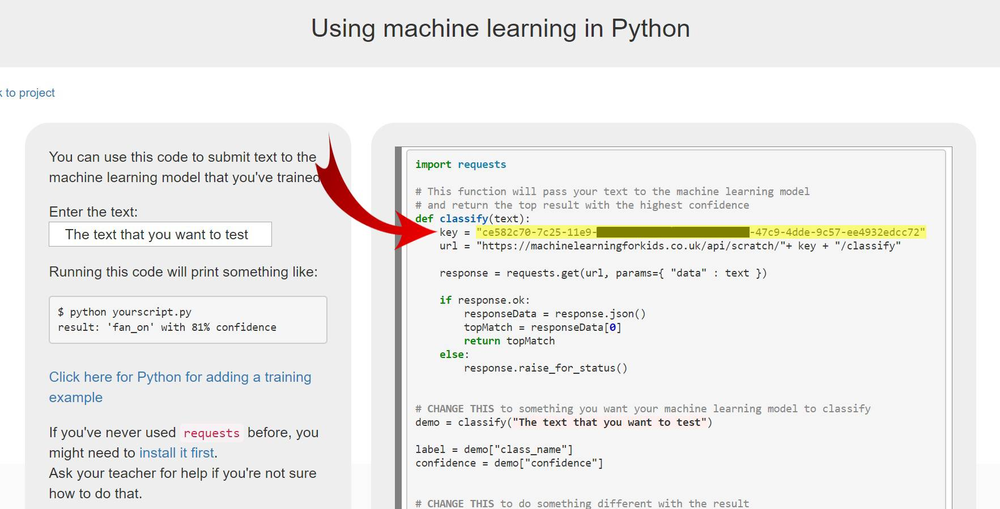  
  
&nbsp;&nbsp;&nbsp;&nbsp;&nbsp;&nbsp;**__Do not use the keys displayed in the images above. Use the keys from your project pages.__**

2. Copy and paste the API Key into the ML4K component’s “Key” property on the Designer screen or use the "set Key" block on the Blocks screen. Note: API Key must be set before you can use any of the ML4K extension blocks for classification. If you choose to set the key using the “set Key” block, be sure to set the key in the Screen.Initialize event or any time before you use a classification method (purple block).

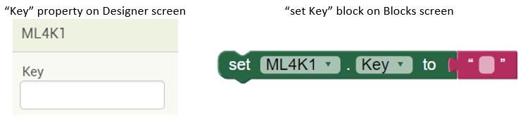  

3. Classify the text, image, or numbers:   
  a. If classifying text, use the "ClassifyText" block with the text to classify.  
    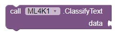  
  b. If classifying images, use the "ClassifyImage" block with the image path to classify.  
    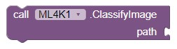  
  c. If classifying numbers, use the "ClassifyNumbers" block with a list of numbers to classify.  
    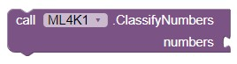  

4. Use the "GotClassification" event block to retrieve the classification once it is completed.  
    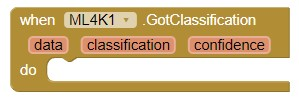

5. Use the "GotError" event block to retrieve any errors which occur during classification.  
    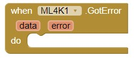

6. Add data to your machine learning project with code:  
  a. To add data to a text project use the "AddTextTrainingData" block, identifying the text data to add and label to add it to.  
    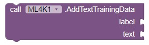  
  b. To add data to an image project use the "AddImageTrainingData" block, identifying the image file to add and label to add it to.  
    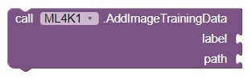  
  c. To add data to a numbers project use the "AddNumbersTrainingData" block, identifying the list of numbers and label to add it to.  
    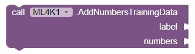  
  
7. Use the "GetModelStatus" block to see if your model is ready to use or still in the process of training.  
      
  
8. Use the "GotStatus" event block to retrieve the status of the model.  
    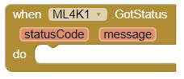  
    * statusCode 2 - "Ready" - The model is trained and ready to use.  
    * statusCode 1 - "Training in progress" - The model is still training and cannot be used.  
    * statusCode 0 - Something went wrong (or there isn't a model) - the 'message' variable will contain information on the issue.  

### Handling Errors
Upon an error, the "GotError" event block will be called with the error that occurred. Please use this event block fro debugging.  
      

## Building with preset API key
To build the extension, open a terminal and navigate to the release folder. Run the build_aix.py script, passing in the API key.

```Shell
cd release
python build_aix.py <API KEY>
```

This will generate a ML4K.aix file which contains a preset API key.

To do this without the Python script, the file com.kylecorry.ml4k/assets/api.txt needs to be modified to have the API key in it. Then the whole folder (com.kylecorry.ml4k directory needs to be present in the top level of the zip file) needs to be zipped and renamed to have the .aix extension instead of .zip.

## Building from source

### Unix (Linux / Mac)
To build the extension from sources, you can use the makefile.

#### Requirements
- make
- ant
- git

#### Building
```shell
make
```

This will create a directory called \_build/dist which will contain the .aix file (without an API key).

### Windows
To build the extension from sources, you can use the build.bat.

#### Requirements
- ant
- git

#### Building
```shell
.\build.bat
```

This will create a directory called \_build/dist which will contain the .aix file (without an API key).

## License
This project is licensed under the [MIT License](LICENSE).

## Featured projects
Here are some community contributed projects which demonstrate awesome uses of the ML4K extension. All credits belong to the creators of these projects:
- [eFAP: Emotion Detector for Angry Players](https://youtu.be/LZ760BT8QmM)

## Credits
* [The Machine Learning for Kids](https://github.com/IBM/taxinomitis) for providing the training tool and API endpoint.
* [Kyle Corry (Me)](https://github.com/kylecorry31) for project planning, programming the extension, and testing.
* [Joe Mazzone](https://github.com/MrMazzone) for project planning, testing, and examples.

## Contribute
Please feel free to contribute to this extension, or if you find an issue be sure to report it under issues.
